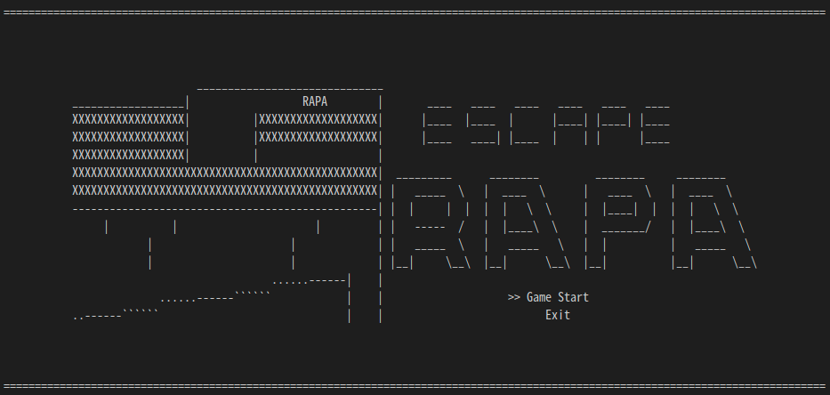

# RAPA탈출 (Escape RAPA)
### Presented by Team Tayo Games
본 프로젝트는 한국전파진흥협회 에서 진행되는 '5G 영상처리를 활용한 AI 자율비행 통제시스템' 에서 진행되었습니다.


# Installation
Dependency
```
sudo apt-get install libncurses5-dev
```
Clone github and build using Makefile
```bash
https://github.com/blackcoke/Proj_escape_RAPA.git
make
```

# Execution
```
./main
```
# Test Video
Link: [Youtube Escape RAPA][escapeRAPA]

[escapeRAPA]: https://youtu.be/gGOezOtSfnM "Escape RAPA"